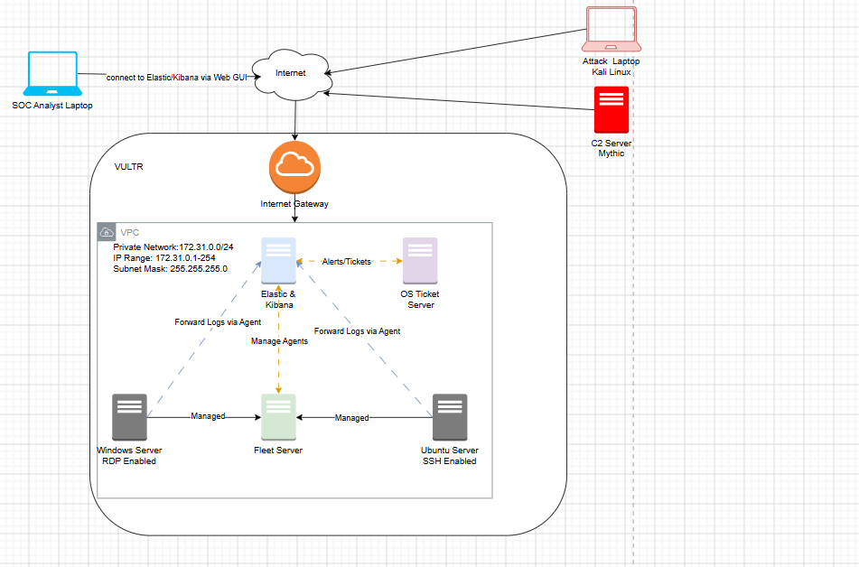

# Detection Lab

> An end-to-end Security Operations Center (SOC) Detection Lab built using Elastic Stack, Fleet, Sysmon, Microsoft Defender, Mythic C2, and osTicket to simulate real-world attacks, engineer detections, investigate alerts, and document incident response.

<p align="center">


<br>


<br>


</p>

## Architecture



> An end-to-end Security Operations Center (SOC) Detection Lab built using Elastic Stack, Fleet, Sysmon, Microsoft Defender, Mythic C2, and osTicket to simulate real-world attacks, engineer detections, investigate alerts, and document incident response.

---

## Project Overview

This project demonstrates the deployment of a cloud-based Detection Lab capable of collecting endpoint telemetry, simulating adversary activity, detecting malicious behaviour, and managing security incidents.

The lab was built in Vultr Cloud using multiple virtual machines connected through a private network and incorporates enterprise security tools commonly used by Security Operations Centers (SOCs).

---

## Technologies Used

| Category | Technology |
|----------|------------|
| Cloud | Vultr |
| SIEM | Elasticsearch |
| Visualization | Kibana |
| Endpoint Management | Fleet |
| Endpoint Monitoring | Elastic Agent |
| Endpoint Telemetry | Sysmon |
| Endpoint Protection | Microsoft Defender |
| Command & Control | Mythic C2 |
| Ticketing | osTicket |
| Operating Systems | Ubuntu Server, Windows Server 2025, Kali Linux |


---

## Lab Objectives

- Deploy a cloud-based SOC environment.
- Collect Windows endpoint telemetry.
- Simulate attacker behaviour using Mythic C2.
- Create custom detection rules in Elastic Security.
- Investigate alerts using Kibana.
- Integrate osTicket into the incident response workflow.
- Document the complete deployment and investigation process.

---

## Documentation

The complete project walkthrough can be found in the **docs** folder.

| Document | Description |
|----------|-------------|
| Lab Overview | Project architecture and objectives |
| Infrastructure | Vultr deployment and networking |
| Elastic Stack | Elasticsearch and Kibana installation |
| Fleet | Fleet Server and Agent configuration |
| Windows Telemetry | Sysmon, Defender, and Event Logs |
| Mythic C2 | Deployment and payload generation |
| Attack Simulation | Adversary emulation |
| Detection Engineering | Custom Elastic detection rules |
| Incident Response | Alert investigation and analysis |
| osTicket | Deployment and integration |
| Lessons Learned | Project reflection and future improvements |

---

## Repository Structure

```text
Detection-Lab
│
├── architecture/
├── detections/
├── docs/
├── screenshots/
└── README.md
```

---

## Skills Demonstrated

- Security Monitoring
- Detection Engineering
- Threat Hunting
- Incident Response
- SIEM Administration
- Windows Security
- Linux Administration
- Cloud Infrastructure
- Network Security
- Technical Documentation

---

## Future Improvements

- Complete Elastic → osTicket API integration
- Add VirusTotal enrichment
- Implement Sigma rules
- Expand Active Directory attack scenarios
- Add automated alert enrichment
- Integrate SOAR workflows

---

## Author

**Omphulusa Khavhatondwi**

- GitHub: https://github.com/Omphulusak
- LinkedIn: https://www.linkedin.com/in/omphulusa-khavhatondwi-86a907246
