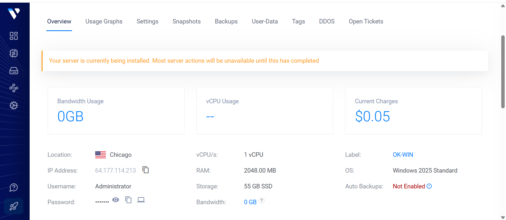
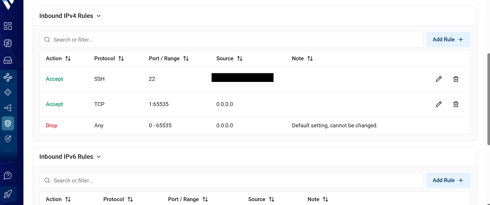
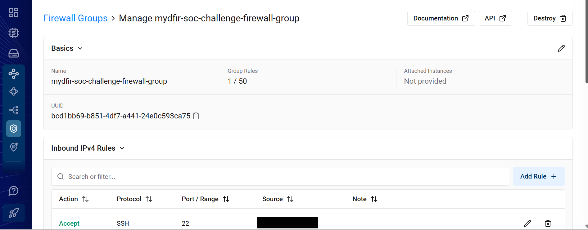
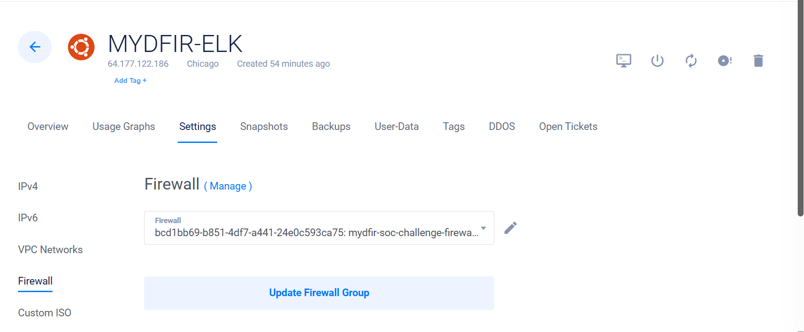

# 02 - Infrastructure Deployment

## Objective

The first phase of the Detection Lab involved deploying the cloud infrastructure that would host the Security Operations Center (SOC).

The environment was built on **Vultr Cloud**, with separate virtual machines dedicated to security monitoring, attack simulation, and incident management.

---

# Lab Infrastructure

The Detection Lab consists of the following virtual machines.

| Server | Operating System | Purpose |
|---------|------------------|---------|
| Elastic Server | Ubuntu Server 24.04 | Elasticsearch, Kibana and Fleet |
| Windows Endpoint | Windows Server 2025 | Endpoint monitoring and attack simulation |
| Mythic Server | Ubuntu Server 24.04 | Command & Control (C2) |
| osTicket Server | Windows Server 2025 | Incident Management |
| Attacker Machine | Kali Linux | Red Team simulation |

---

# Deploy the Windows Server

The Windows Server 2025 instance was deployed using Vultr Cloud and later configured as the monitored endpoint throughout the project.

---

# Configure Firewall Rules

Firewall Groups were created to restrict inbound traffic and expose only the services required by the lab.

The following ports were configured throughout the project:

| Port | Service |
|------|---------|
| 22 | SSH |
| 80 | HTTP |
| 443 | HTTPS |
| 3389 | RDP |
| 5601 | Kibana |
| 8220 | Fleet Server |
| 9200 | Elasticsearch |

---

# Restrict SSH Access

To improve security, SSH access to the Ubuntu servers was restricted to my public IP address.

This reduced the attack surface and prevented unauthorized remote access.

---

# Attach Firewall Groups

After configuring the firewall rules, the Firewall Group was attached to the cloud instance.

---

# Private Networking (VPC)

The servers were connected using a Vultr Virtual Private Cloud (VPC).

Using a private network allowed communication between the Elastic Server, Windows Endpoint, Mythic C2 Server, and osTicket Server without exposing internal traffic to the public Internet.

---

# Infrastructure Summary

At the end of this phase:

- Ubuntu Server deployed
- Windows Server deployed
- Firewall Groups configured
- SSH secured
- Private networking configured
- Infrastructure ready for Elastic Stack deployment

---

## Next Step

The next stage focuses on installing and configuring the Elastic Stack.

➡️ **Next:** `03-Elastic-Stack.md`
