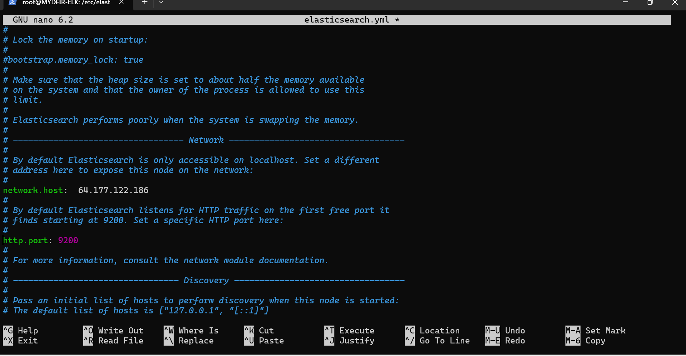
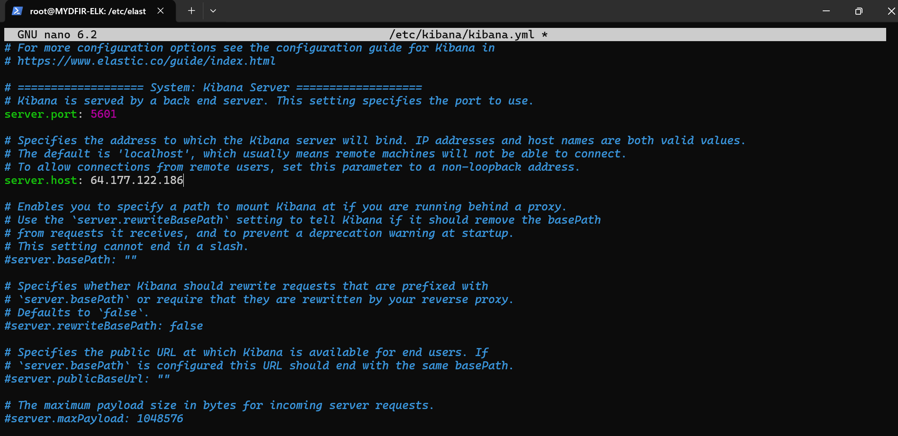
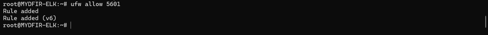

# 03 - Deploying the Elastic Stack

## Objective

With the cloud infrastructure in place, the next phase involved deploying the Elastic Stack, which serves as the Security Information and Event Management (SIEM) platform for the Detection Lab.

Elastic provides centralized log collection, data indexing, visualization, security analytics, and detection capabilities.

The following components were deployed:

- Elasticsearch
- Kibana
- Fleet Server (configured later)

---

# Updating the Server

Before installing Elastic, the Ubuntu server was updated to ensure all system packages were current.

This helps improve compatibility and ensures the latest security patches are installed.

---

# Verify Server Network Configuration

Before installing Elastic, the server's IP address was verified to ensure the correct interface would be used throughout the deployment.

---

# Configure Elasticsearch

After installation, Elasticsearch was configured to allow remote communication.

The following settings were modified:

- `network.host`
- `http.port`

This allowed Elasticsearch to accept connections from other systems within the Detection Lab.

---

# Configure Kibana

Kibana was configured to communicate with Elasticsearch and listen on the server's network interface.

Configuration included:

- `server.host`
- `elasticsearch.hosts`

---

# Allow Kibana Through the Firewall

To allow remote access to Kibana, TCP port **5601** was opened using UFW.

---

# Verify Kibana

After restarting the services, Kibana was successfully accessed through a web browser.

This confirmed that the SIEM platform was operational and ready for Fleet Server configuration.

---

# Summary

At the end of this phase:

- Ubuntu server updated
- Elasticsearch installed
- Kibana installed
- Remote access configured
- Firewall updated
- SIEM platform operational

---

## Next Step

The next stage focuses on deploying Fleet Server and preparing the environment for endpoint telemetry collection.

➡️ **Next:** `04-Fleet-Server.md`
