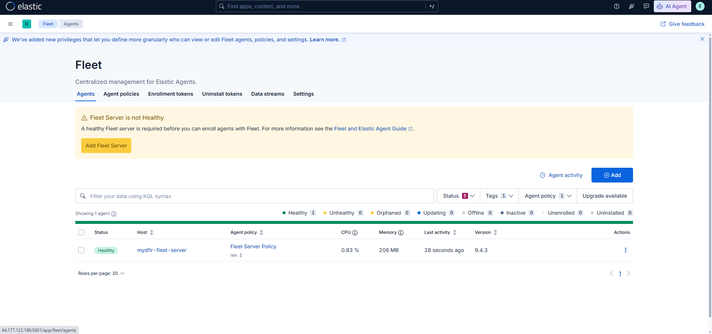

# 04 - Configure Fleet Server

## Objective

After deploying the Elastic Stack, the next phase focused on configuring **Fleet Server**, which provides centralized management of Elastic Agents across the Detection Lab.

Fleet simplifies endpoint management by allowing agents to be enrolled, monitored, and configured from a single interface within Kibana.

---

# What is Fleet?

Fleet is Elastic's centralized management platform for Elastic Agents.

Using Fleet, administrators can:

- Enroll new endpoints
- Deploy integrations
- Monitor agent health
- Collect endpoint telemetry
- Manage security policies

This provides a scalable approach to monitoring multiple endpoints within a Security Operations Center (SOC).

---

# Create a Fleet Server Policy

A dedicated Fleet Server policy was created within Kibana to manage enrolled agents.

The policy acts as the central configuration for all endpoints connected to the Detection Lab.

---

# Enroll the Windows Endpoint

After Fleet Server was operational, the Windows Server endpoint was enrolled using the Elastic Agent installation package and enrollment token generated by Kibana.

Once the installation completed successfully, the endpoint appeared within the Fleet dashboard.

---

# Verify Agent Status

The enrolled endpoint was monitored from the Fleet dashboard to confirm successful communication with the Elastic Stack.

A healthy agent confirmed that logs and telemetry were successfully being forwarded to Elasticsearch.

---

# Why Fleet?

Fleet provides several operational benefits:

- Centralized endpoint management
- Remote policy deployment
- Integration management
- Agent health monitoring
- Simplified log collection
- Scalable endpoint administration

These capabilities make Fleet an essential component of modern Security Operations Centers.

---

# Summary

At the end of this phase:

- Fleet Server configured
- Windows endpoint enrolled
- Agent communication verified
- Endpoint management operational
- Environment prepared for telemetry collection

---

## Next Step

With the Windows endpoint successfully enrolled, the next phase focuses on collecting detailed Windows telemetry using Sysmon, Microsoft Defender, and Windows Event Logs.

➡️ **Next:** `05-Windows-Telemetry.md`
