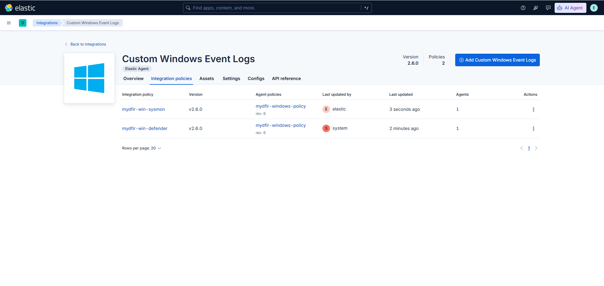
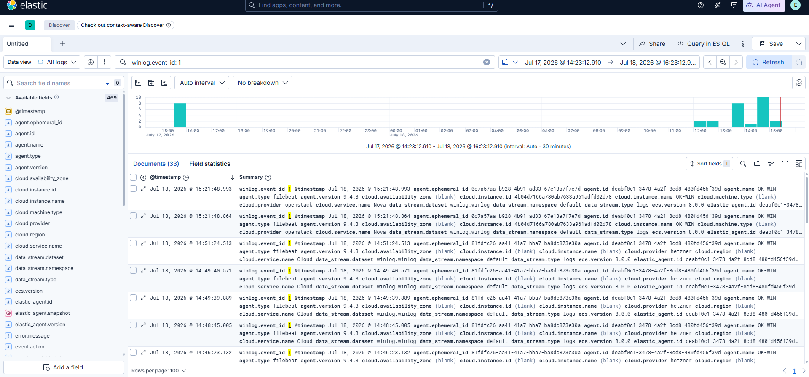

# 05 - Windows Endpoint Telemetry

## Objective

With Fleet Server successfully deployed, the next phase involved configuring Windows endpoint telemetry.

Collecting detailed telemetry is essential for detecting malicious activity, performing investigations, and building reliable detection rules.

To improve endpoint visibility, the following technologies were deployed:

- Elastic Agent
- Sysmon
- Microsoft Defender
- Windows Event Logs

---

# Why Endpoint Telemetry?

Windows generates thousands of events every day.

By collecting these events centrally in Elasticsearch, security analysts can:

- Monitor endpoint activity
- Detect suspicious behaviour
- Investigate security incidents
- Correlate events across multiple systems

This provides complete visibility into attacker behaviour during the attack simulation.

---

# Download Sysmon

Sysmon (System Monitor) was downloaded from Microsoft's Sysinternals Suite.

Sysmon extends Windows logging by recording detailed endpoint activity that is not available in the default Windows Security log.

---

# Install Elastic Agent

The Windows Server was enrolled into Fleet using the Elastic Agent installation package.

After installation, the endpoint successfully connected to the Elastic Stack and began forwarding telemetry.

---

# Configure Windows Event Log Integrations

To improve visibility, custom Windows Event Log integrations were added within Fleet.

The following channels were configured:

- Microsoft-Windows-Sysmon/Operational
- Microsoft-Windows-Windows Defender/Operational

---

# Verify Log Collection

After configuring the integrations, Windows events began appearing within Elasticsearch.

The logs confirmed that Sysmon and Microsoft Defender telemetry were successfully being collected.

---

# Important Events Collected

The Detection Lab captures several high-value security events.

| Event Source | Purpose |
|--------------|---------|
| Sysmon Event ID 1 | Process Creation |
| Sysmon Event ID 3 | Network Connections |
| Sysmon Event ID 11 | File Creation |
| Microsoft Defender | Malware Detection |
| Windows Event Logs | Authentication & System Events |

These events provide the foundation for custom detection engineering later in the project.

---

# Summary

At the end of this phase:

- Sysmon installed
- Elastic Agent enrolled
- Windows Event Logs collected
- Defender telemetry collected
- Endpoint telemetry successfully ingested into Elasticsearch

---

## Next Step

With endpoint telemetry successfully configured, the next phase focuses on deploying Mythic C2 to simulate realistic attacker behaviour.

➡️ **Next:** `06-Deploy-Mythic-C2.md`
