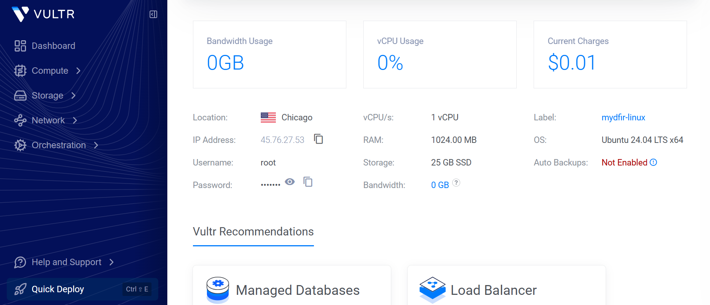
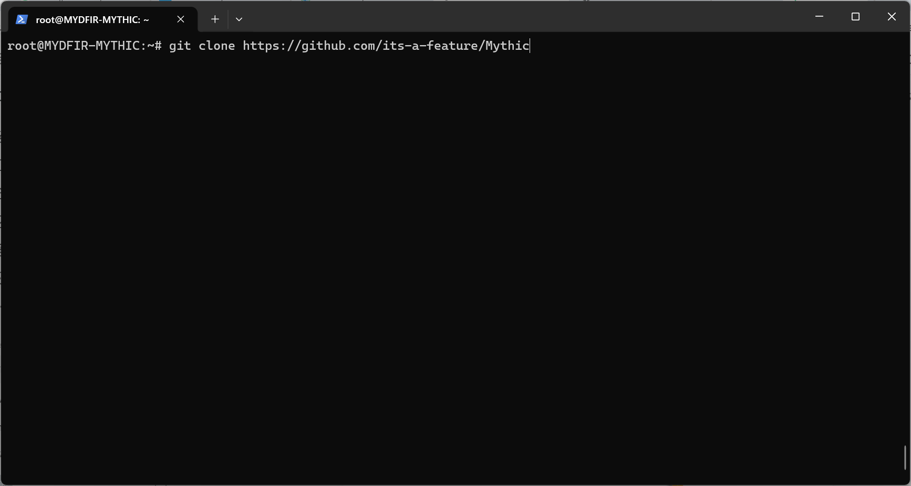

# 06 - Deploy Mythic Command and Control (C2)

## Objective

To simulate realistic post-exploitation activity, Mythic Command and Control (C2) was deployed within the Detection Lab.

Mythic is an open-source adversary emulation framework that enables security professionals to simulate attacker techniques, validate detection rules, and improve incident response capabilities.

> **Note:** Mythic was deployed in an isolated lab environment for educational and defensive security purposes only.

---

# Why Mythic?

Most cyber attacks do not stop after gaining initial access.

Attackers typically:

- Execute commands
- Gather system information
- Move laterally
- Establish persistence
- Exfiltrate data

Deploying Mythic allows these activities to be simulated safely while generating realistic endpoint telemetry for detection and investigation.

---

# Prepare the Ubuntu Server

A dedicated Ubuntu Server was deployed to host the Mythic C2 framework.

Before installation, the server was updated and required packages were installed.

---

# Clone the Mythic Repository

The Mythic source code was cloned from the official GitHub repository.

---

# Configure Firewall Rules

Firewall rules were configured to allow communication between the Windows endpoint and the Mythic server while limiting unnecessary exposure.

---

# Deploy Mythic

After installation, the Mythic services were started and verified.

The following services became available:

- Mythic Web Interface
- Mythic API
- Docker Containers
- HTTP C2 Profile

The management interface was then accessed through a web browser.

---

# Verify Deployment

The deployment was verified by confirming:

- Docker containers were running
- Mythic services were healthy
- The web interface loaded successfully
- Operator login was successful

This confirmed the environment was ready for payload generation.

---

# Summary

At the end of this phase:

- Mythic C2 deployed
- Ubuntu server configured
- Firewall rules applied
- Mythic services operational
- Environment prepared for payload generation

---

## Next Step

With Mythic successfully deployed, the next phase focuses on generating and configuring an Apollo payload for the Windows endpoint.

➡️ **Next:** `07-Apollo-Payload.md`
