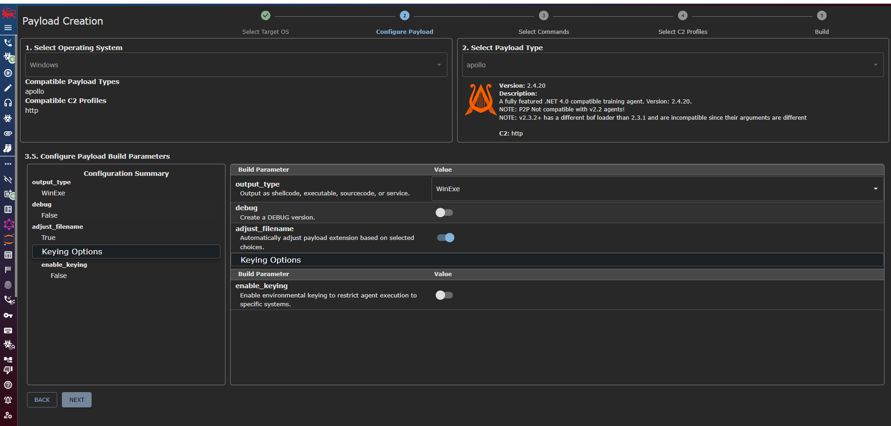

# 07 - Generate the Apollo Payload

## Objective

With Mythic successfully deployed, the next phase involved generating a Windows payload capable of establishing communication with the Mythic Command and Control (C2) server.

The Apollo agent was selected because it provides extensive post-exploitation capabilities while generating realistic endpoint telemetry for detection engineering and incident response exercises.

> **Disclaimer:** This payload was generated and executed only within an isolated Detection Lab for educational and defensive security purposes.

---

# What is Apollo?

Apollo is the Windows agent used by Mythic.

Once executed on a Windows endpoint, Apollo is capable of:

- Establishing Command and Control (C2)
- Executing commands
- Collecting system information
- Browsing the file system
- Transferring files
- Generating realistic attacker telemetry

This makes it an excellent tool for validating SIEM detections and SOC workflows.

---

# Configure the HTTP C2 Profile

Before generating the payload, the HTTP C2 profile was configured within Mythic.

The profile defines how the payload communicates with the Mythic server after execution.

Configuration included:

- Callback Host
- Callback Interval
- Payload Type
- Communication Protocol
- Encryption Settings

---

# Generate the Apollo Payload

A new Windows payload was generated using the Apollo agent.

The payload configuration included:

- Payload Type: Apollo
- Operating System: Windows
- Output Type: WinExe
- C2 Profile: HTTP



---

# Payload Preparation

To better simulate a real-world intrusion, the generated executable was renamed before deployment.

```text
svchost-mydfir.exe
```

Renaming the payload allows custom detection rules to identify suspicious process execution based on multiple indicators rather than relying only on filenames.

---

# Detection Opportunities

Executing the Apollo payload generates valuable telemetry, including:

- Process Creation
- Command-line Activity
- Network Connections
- Parent-Child Process Relationships
- File Creation
- HTTP Command and Control Traffic

These events are collected by:

- Elastic Agent
- Sysmon
- Windows Event Logs
- Microsoft Defender

---

# Why This Matters

One of the primary goals of this Detection Lab is to generate realistic attack telemetry rather than synthetic log data.

Using Apollo enables:

- Detection Rule Testing
- Threat Hunting
- IOC Validation
- Alert Investigation
- Incident Response Practice

---

# Summary

At the end of this phase:

- Apollo payload generated
- HTTP C2 profile configured
- Payload prepared for execution
- Environment ready for attack simulation

---

## Next Step

The next phase demonstrates a complete attack against the Windows endpoint, including initial access, discovery, payload execution, and Command and Control communication.

➡️ **Next:** `08-Attack-Simulation.md`
