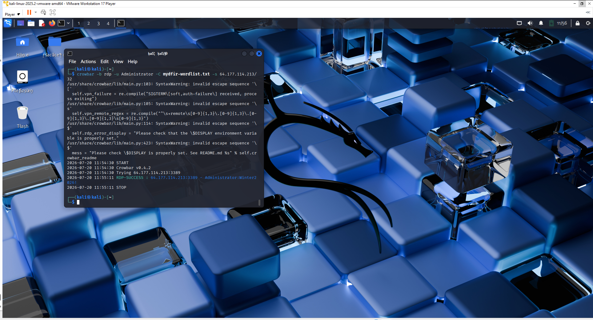
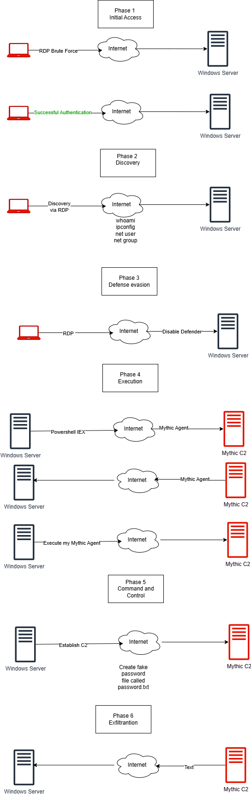

# 08 - Attack Simulation

## Objective

With the Detection Lab fully deployed, the next phase focused on simulating a realistic attack against the Windows endpoint.

The purpose of this exercise was to generate endpoint telemetry that could be collected by Elastic, analysed within Kibana, and investigated as part of a Security Operations Center (SOC) workflow.

> **Disclaimer:** All attack activity described in this document was performed in an isolated lab environment owned and controlled for educational and defensive security purposes.

---

# Attack Scenario

The simulated attack followed a realistic intrusion workflow based on the MITRE ATT&CK framework.

The attack consisted of the following stages:

1. Initial Access
2. Discovery
3. Payload Execution
4. Command and Control
5. Detection
6. Investigation

---

# Initial Access

The attack began with a controlled RDP password attack against the Windows Server.

Once the correct credentials were identified, a Remote Desktop session was established successfully.



### Detection Opportunities

- Multiple failed authentication attempts
- Successful RDP logon
- Administrator account usage
- Source IP identification

---

# Discovery

After obtaining access to the endpoint, system reconnaissance was performed.

Typical discovery commands included:

```text
whoami
hostname
ipconfig
net user
net group
```

These commands simulate how an attacker gathers information before progressing further into the environment.

---

# Payload Execution

The Apollo payload generated during the previous phase was transferred to the Windows endpoint and executed.

The executable had been renamed to:

```text
svchost-mydfir.exe
```

Executing the payload generated:

- Process Creation Events
- Command-line Activity
- Network Connections
- File Creation Events

These activities were collected by Elastic Agent and Sysmon.

---

# Command and Control

After execution, the payload successfully established communication with the Mythic Command and Control server.

This created an active callback, allowing controlled interaction with the compromised endpoint.


The callback enabled activities such as:

- Viewing system information
- Listing files and directories
- Executing remote commands
- Collecting endpoint telemetry

---

# Attack Timeline

The complete attack workflow is illustrated below.



The simulation demonstrates the progression from initial access through post-exploitation and Command and Control.

---

# MITRE ATT&CK Mapping

| Technique | ID |
|-----------|----|
| Brute Force | T1110 |
| Account Discovery | T1087 |
| System Information Discovery | T1082 |
| PowerShell | T1059.001 |
| Application Layer Protocol | T1071.001 |
| Data from Local System | T1005 |

---

# Summary

The attack successfully generated realistic endpoint telemetry that would later be used to create custom detection rules and perform incident investigations.

Rather than simply generating logs, the simulation demonstrated how attacker behaviour can be reproduced safely within a controlled environment to validate SOC detection capabilities.

---

## Next Step

The next phase focuses on creating custom detection rules within Elastic Security to identify the activity generated during this attack.

➡️ **Next:** `09-Detection-Engineering.md`
